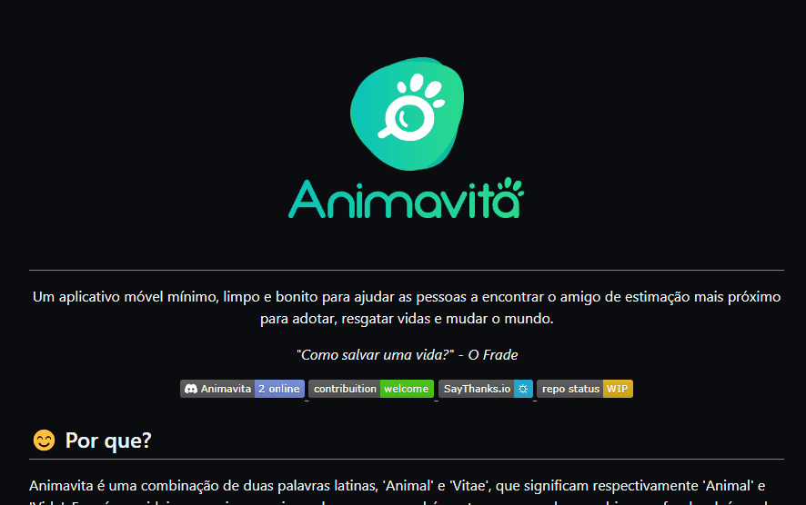

# Projeto com README
Um projeto de testes com um arquivo README 🐱‍🚀

[]

## Tecnologias utilizadas
- HTML
- CSS
- JS

## Como utilizar

1 - Acesse a pasta do projeto

Clone o projeto

git clone <url>

2 -  Acesse a pasta do projeto

cd repositorio-com-readme
